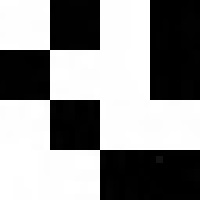

# Maze

Реализация проекта Maze.

## Содержание

0. [Введение](#введение)
1. [Информация](#информация) \
    1.1. [Описание лабиринта](#описание-лабиринта) \
    1.2. [Генерация с использованием клеточного автомата](#генерация-с-использованием-клеточного-автомата) \
    1.3. [Описание пещер](#описание-пещер)
2. [Реализация проекта Maze](#реализация-проекта-Maze) \
    2.1. [Генерация идеального лабиринта](#генерация-идеального-лабиринта) \
    2.2. [Решение лабиринта](#решение-лабиринта) \
    2.3. [Генерация пещер](#генерация-пещер) 


 

## Введение

В данном проекте нам предстояло познакомиться с лабиринтами и пещерами, а также основными алгоритмами их обработки, такими как: генерация, отрисовка, поиск решения.


## Информация

Лабиринт с "тонкими стенками" представляет собой таблицу размером _n_ строк на _m_ столбцов. 
Между ячейками таблицы могут находиться "стены". Также "стенами" окружена вся таблица в целом. 

Решением лабиринта считается кратчайший путь от заданной начальной точки (ячейки таблицы) до конечной. 
При прохождении лабиринта можно передвигаться к соседним ячейкам, не отделенным "стеной" от текущей ячейки и находящимся сверху, снизу, справа или слева. 
Кратчайшим маршрут считается, если он проходит через наименьшее число ячеек.


## Описание лабиринта

Лабиринт храниться в файле в виде количества строк и столбцов, а также двух матриц, содержащих положение вертикальных и горизонтальных стен соответственно. 
В первой матрице отображается наличие стены справа от каждой ячейки, а во второй - снизу. 

Пример подобного файла:  
```
4 4
0 0 0 1
1 0 1 1
0 1 0 1
0 0 0 1

1 0 1 0
0 0 1 0
1 1 0 1
1 1 1 1
```

Лабиринт, описанный в этом файле: \


## Генерация с использованием клеточного автомата

Во многих играх есть необходимость в ветвящихся локациях, например пещерах. 
Такие локации могут быть созданы генерацией с использованием клеточного автомата. 
При подобной генерации используется идея, схожая с игрой "Жизнь". 
Суть предложенного алгоритма состоит в реализации всего двух шагов: 
сначала все поле заполняется случайным образом стенами — т.е. для каждой клетки случайным образом определяется, 
будет ли она свободной или непроходимой — а затем несколько раз происходит обновление состояния карты в соответствии с условиями, 
похожими на условия рождения/смерти в «Жизни».

Правила проще, чем в "Жизни" - есть две специальные переменные, одна для "рождения" "мертвых" клеток (предел "рождения") и одна для уничтожения "живых" клеток (предел "смерти"). 
Если "живые" клетки окружены "живыми" клетками, количество которых меньше, чем предел "смерти", они "умирают". 
Аналогично если "мертвые" клетки находятся рядом с "живыми", количество которых больше, чем предел "рождения", они становятся "живыми".

## Описание пещер

Пещера, прошедшая 0 шагов симуляции (только инициализированная), может храниться в файле в виде количества строк и столбцов, 
а также матрицы, содержащей положение "живых" и "мертвых" клеток.

Пример подобного файла:
```
4 4
0 1 0 1
1 0 0 1
0 1 0 0
0 0 1 1
```

Пещера, описанная в этом файле: \


## Реализация проекта Maze

Программа Maze, позволяет генерировать и отрисовывать идеальные лабиринты и пещеры:

- Программа разработана на языке C++ стандарта C++17
- При написании кода придерживались Google Style
- Сборка программы настроена с помощью Makefile со стандартным набором целей для GNU-программ: all, install, uninstall, clean, dvi, dist, tests.
- В программе реализован графический пользовательский интерфейс на базе Qt
- В программе предусмотрена кнопка для загрузки лабиринта из файла, который задается в формате, описанном [здесь](#описание-лабиринта) 
- Максимальный размер лабиринта - 50х50
- Загруженный лабиринт отрисовывается на экране в поле размером 500 x 500 пикселей
- Толщина "стены" - 2 пикселя
- Размер самих ячеек лабиринта вычисляется таким образом, чтобы лабиринт занимает всё отведенное под него поле

## Генерация идеального лабиринта

Добавлена возможность автоматической генерации идеального лабиринта. \
Идеальным считается лабиринт, в котором из каждой точки можно попасть в любую другую точку ровно одним способом.

- Генерация лабиринта осуществляется согласно **алгоритма Эллера**
- Сгенерированный лабиринт не имеет изолированных областей и петель
- Обеспечено покрытие unit-тестами модуля генерации идеального лабиринта
- Пользователем вводится только размерность лабиринта: количество строк и столбцов
- Сгенерированный лабиринт можно сохранить в файл в формате, описанном [здесь](#описание-лабиринта) 
- Созданный лабиринт отображается на экране как указано в [здесь](#реализация-проекта-maze)

## Решение лабиринта

Добавлена возможность показать решение _любого_ лабиринта, который сейчас изображен на экране:
- Пользователем задаются начальная и конечная точки
- Маршрут, являющийся решением, отобразиться линией толщиной 2 пикселя, проходящей через середины всех ячеек лабиринта, через которые пролегает решение
- Обеспечено покрытие unit-тестами модуля решения лабиринта

## Генерация пещер

Добавлена генерация пещер с [использованием клеточного автомата](#генерация-с-использованием-клеточного-автомата):
- Пользователем выбирается файл, в котором описан пещера по описанному [здесь](#описание-пещер) формату
- Для отображения пещер используется отдельная вкладка пользовательского интерфейса
- Максимальный размер пещеры - 50 х 50
- Загруженная пещера отрисовывается на экране в поле размером 500 x 500 пикселей
- Пользователем задаются пределы "рождения" и "смерти" клетки, а также шанс на начальную инициализацию клетки
- Пределы "рождения" и "смерти" могут иметь значения от 0 до 7
- Предусмотрен пошаговый режим отрисовки результатов работы алгоритма в двух вариантах:
  - По нажатию на кнопку следующего шага отрисовывается очередная итерация работы алгоритма
  - По нажатию на кнопку автоматической работы запускается отрисовка итераций работы алгоритма с частотой 1 шаг в `N` миллисекунд, где число миллисекунд `N` задаётся через специальное поле в пользовательском интерфейсе
- Размер клеток в пикселях вычисляется таким образом, чтобы пещера занимала всё отведенное под него поле
- Обеспечено покрытие unit-тестами модуля генерации пещер
